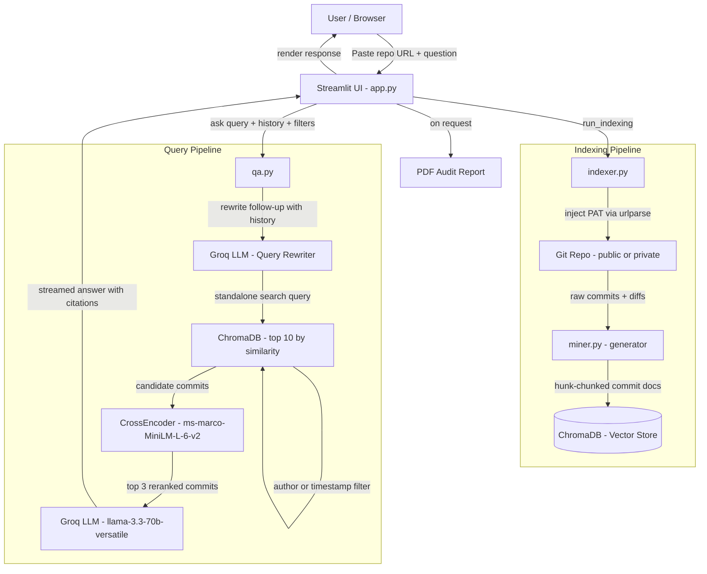

# Legacy Code Archaeologist

A RAG-based tool that lets you query the **history** of any Git repository in plain English — not the current code, but *why it became what it is*.


---

## Architecture



---

## Demo

https://github.com/user-attachments/assets/9e3cd9ae-e9a1-4eeb-b057-3065f0206aee

---

## Key engineering decisions

**Query rewriting**
Follow-up questions like "who worked on it?" are rewritten into standalone search queries before hitting ChromaDB. The LLM uses conversation history to resolve vague references — so retrieval is context-aware, not just keyword-based.

**Two-stage retrieval (ChromaDB + reranker)**
Pure vector similarity returns commits that *look* related. The cross-encoder (`ms-marco-MiniLM-L-6-v2`) re-scores each result against your exact question and keeps only the top 3. Precision over recall.

**Hunk-based diff chunking**
Diffs are split at `@@` boundaries, not truncated at a character limit. The LLM sees complete, meaningful code hunks — so it can say "the value changed from 5 to 10" rather than a vague summary.

**Timestamp-based metadata filtering**
Author and date range filters are pushed down to ChromaDB `where` clauses using Unix timestamps for accurate numeric comparison. If a filter returns no commits, the tool says so explicitly instead of silently falling back to unfiltered results.

**Multi-turn conversation**
Last 5 turns of chat history are injected into every LLM call. Follow-up questions work without repeating context.

**Private repo support**
GitHub PAT is injected into the clone URL at runtime via `urlparse` — never written to disk, wiped on reset.

**O(1) memory mining**
The commit iterator is a Python generator. Shallow cloning (`--depth`) keeps fetches fast for recent history queries.

---

## Stack

| Layer | Technology |
|---|---|
| UI | Streamlit |
| LLM | Groq — `llama-3.3-70b-versatile` |
| Vector DB | ChromaDB |
| Embeddings | `all-MiniLM-L6-v2` |
| Reranker | `cross-encoder/ms-marco-MiniLM-L-6-v2` |
| Git parsing | GitPython |
| Package manager | uv |

---

## Project structure

```
├── app.py          # Streamlit UI
├── indexer.py      # Clone + batch-index into ChromaDB
├── qa.py           # Query rewriting → Retrieval → reranking → LLM call
├── miner.py        # Generator-based diff parser
├── utils.py        # PDF export, cleanup, token injection
└── tests/          # 49 tests, no external services required
```

---

## Installation

```bash
git clone https://github.com/kartik0905/git-archaeologist.git
cd git-archaeologist
uv pip install -r requirements.txt
cp .env.example .env   # add your Groq API key
streamlit run app.py
```

> The first query downloads the reranker model (~90MB) and caches it locally. All subsequent runs load from cache.

---

## Known limitations

- Shallow clones may miss commits outside the selected depth window.
- Author filtering requires an exact Git config name match.
- Reranker runs on CPU — adds ~1–2 seconds per query on large result sets.

---

## Built by Kartik Garg